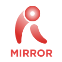

  
  <h1 align="center">RevoMirror</h1>
  <h4 align="center">Cross-platform remote screen mirroring & PC remote control over LAN.</h4>

  
  
  
  

  <b>English</b> | <a href="README.zh-CN.md">简体中文</a>

## ℹ️ About

**RevoMirror** is a cross-platform remote screen mirroring and remote control solution
developed by **Revopoint Software**. It is built on top of the open-source project
[Sunshine](https://github.com/LizardByte/Sunshine) (licensed under GPL-3.0), leveraging
its high-performance, low-latency streaming capabilities.

RevoMirror enables:

- 🖥️ **Screen Mirroring** — Mirror your PC desktop to mobile devices in real time.
- 🎮 **Remote Control** — Control your PC desktop directly from a mobile device, enabling
  full remote operation of the host machine.
- 🌐 **LAN-based** — Works within the same local area network (LAN) or subnet for
  low-latency, secure connections.

By integrating Sunshine's hardware-accelerated encoding and capture pipeline, RevoMirror
delivers a smooth, responsive remote desktop experience across devices.

> **Note:** RevoMirror is a derivative work based on Sunshine. The core streaming engine
> is provided by Sunshine, while the RevoMirror application (located in the `tools`
> directory) adds the mirroring, remote control, and cross-platform client capabilities.

## 🚀 Key Features

- **Cross-Platform Support** — Host and clients available on:
  - Host: Windows, macOS, Linux
  - Client: Windows, macOS, Linux, Android, iOS
- **PC → Mobile Mirroring** — Stream your PC desktop to mobile devices.
- **Mobile → PC Remote Control** — Operate your PC remotely from a mobile device, including
  keyboard, mouse, and touch input.
- **Low Latency** — Hardware-accelerated video encoding for a near-real-time experience.
- **Same-Network Operation** — Designed for use within the same LAN or subnet.
- **Multi-GPU Encoding** — Supports AMD, Intel, and NVIDIA hardware encoding, with software
  encoding fallback (inherited from Sunshine).

## 🧩 How It Works

RevoMirror is integrated into the Sunshine source tree under the `tools/RevoMirror`
directory. It utilizes Sunshine's:

- **Screen capture** pipeline (DXGI, ScreenCaptureKit, KMS/DRM, X11, Wayland, etc.)
- **Hardware encoding** APIs (NVENC, QuickSync, AMF, VideoToolbox, VAAPI, etc.)
- **Streaming protocol** for low-latency video transmission

On top of this, RevoMirror implements the mirroring workflow and bidirectional
remote-control input handling for mobile and desktop clients.

## 🖥️ Platform Support

| Role | Windows | macOS | Linux | Android | iOS |
|------|:-------:|:-----:|:-----:|:-------:|:---:|
| Host (PC to be controlled/mirrored) | ✅ | ✅ | ✅ | ➖ | ➖ |
| Client (viewer / controller) | ✅ | ✅ | ✅ | ✅ | ✅ |

**Legend:** ✅ Supported | ➖ Not Applicable

## 🎮 Encoding & Capture Compatibility

RevoMirror inherits the encoding and screen capture capabilities of Sunshine.

<table>
    <caption id="encoding_api">Encoding API</caption>
    <tr>
        <th>Encoding API</th>
        <th>GPU Vendor</th>
        <th>Linux</th>
        <th>macOS</th>
        <th>Windows</th>
    </tr>
    <tr><td>AMF</td><td>AMD</td><td>➖</td><td>➖</td><td>✅</td></tr>
    <tr><td>NVENC</td><td>NVIDIA</td><td>✅</td><td>➖</td><td>✅</td></tr>
    <tr><td>QuickSync</td><td>Intel</td><td>➖</td><td>➖</td><td>✅</td></tr>
    <tr><td>VAAPI</td><td>AMD / Intel / NVIDIA</td><td>✅</td><td>➖</td><td>➖</td></tr>
    <tr><td>Video Toolbox</td><td>Apple / Intel</td><td>➖</td><td>✅</td><td>➖</td></tr>
    <tr><td>Software</td><td>Any</td><td>✅</td><td>✅</td><td>✅</td></tr>
</table>

<table>
    <caption id="screen_capture">Screen Capture</caption>
    <tr>
        <th>Capture Method</th>
        <th>Linux</th>
        <th>macOS</th>
        <th>Windows</th>
    </tr>
    <tr><td>DXGI Desktop Duplication</td><td>➖</td><td>➖</td><td>✅</td></tr>
    <tr><td>Windows.Graphics.Capture</td><td>➖</td><td>➖</td><td>✅</td></tr>
    <tr><td>ScreenCaptureKit</td><td>➖</td><td>✅</td><td>➖</td></tr>
    <tr><td>KMS/DRM</td><td>✅</td><td>➖</td><td>➖</td></tr>
    <tr><td>X11</td><td>✅</td><td>➖</td><td>➖</td></tr>
    <tr><td>Wayland (wlroots)</td><td>✅</td><td>➖</td><td>➖</td></tr>
    <tr><td>KWin Screencast</td><td>✅</td><td>➖</td><td>➖</td></tr>
</table>

**Legend:** ✅ Supported | 🟡 Partial Support | ❌ Not Yet Supported | ➖ Not Applicable

## 🖥️ System Requirements

> [!WARNING]
> These tables are a work in progress. Do not purchase hardware based on this information.
> Requirements are inherited from Sunshine.

<table>
    <caption id="minimum_requirements">Minimum Requirements (Host)</caption>
    <tr>
        <th>Component</th>
        <th>Requirement</th>
    </tr>
    <tr>
        <td rowspan="3">GPU</td>
        <td>AMD: VCE 1.0 or higher</td>
    </tr>
    <tr>
        <td>Intel: Skylake or newer with QuickSync (Windows); VAAPI-compatible (Linux)</td>
    </tr>
    <tr>
        <td>NVIDIA: NVENC enabled cards</td>
    </tr>
    <tr>
        <td rowspan="2">CPU</td>
        <td>AMD: Ryzen 3 or higher</td>
    </tr>
    <tr>
        <td>Intel: Core i3 or higher</td>
    </tr>
    <tr>
        <td>RAM</td>
        <td>4GB or more</td>
    </tr>
    <tr>
        <td rowspan="4">OS</td>
        <td>Windows: 11+</td>
    </tr>
    <tr>
        <td>macOS: 14.2+</td>
    </tr>
    <tr>
        <td>Linux/Ubuntu: 22.04+ (jammy)</td>
    </tr>
    <tr>
        <td>Linux/Fedora: 43+ / Debian: 13+</td>
    </tr>
    <tr>
        <td rowspan="2">Network</td>
        <td>Host: 5GHz 802.11ac or wired (same LAN/subnet as client)</td>
    </tr>
    <tr>
        <td>Client: 5GHz 802.11ac or wired (same LAN/subnet as host)</td>
    </tr>
</table>

> For 4K and HDR hardware suggestions, refer to the
> [Sunshine documentation](https://docs.lizardbyte.dev/projects/sunshine), as RevoMirror
> shares the same underlying encoding requirements.

## 📦 Getting Started

> [!NOTE]
> Detailed build and usage instructions are provided in the
> [docs](docs/getting_started.md) directory.

1. Ensure the **host PC** and **client device** are on the **same LAN or subnet**.
2. Install and run RevoMirror on the host PC.
3. Install the RevoMirror client on your device (Windows / macOS / Linux / Android / iOS).
4. Pair the client with the host.
5. Start mirroring and/or remote control.

## 📖 Documentation

- Getting Started: [docs/getting_started.md](docs/getting_started.md)
- For underlying engine details, see the
  [Sunshine documentation](https://docs.lizardbyte.dev/projects/sunshine).

## 📜 License

RevoMirror is licensed under the **GNU General Public License v3.0 (GPL-3.0)**.

This project is a derivative work based on
[Sunshine](https://github.com/LizardByte/Sunshine), which is also licensed under GPL-3.0.
In compliance with the terms of the GPL, RevoMirror is distributed under the same license.

See the [LICENSE](./LICENSE) file for the full license text.

## 🙏 Acknowledgements & Credits

RevoMirror is built upon the excellent work of the following open-source project:

- **[Sunshine](https://github.com/LizardByte/Sunshine)** — Self-hosted game stream host
  for Moonlight.
  Copyright © LizardByte. Licensed under GPL-3.0.

We extend our sincere gratitude to the LizardByte team and all Sunshine contributors.
The original Sunshine license and copyright notices are retained throughout this
repository.

## 🏢 About Revopoint Software

RevoMirror is developed and maintained by **Revopoint Software**
(Xi'an Chishine Optoelectronics Technology Co., Ltd.).
